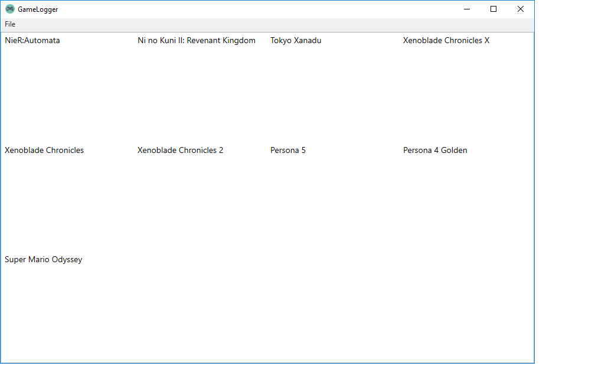
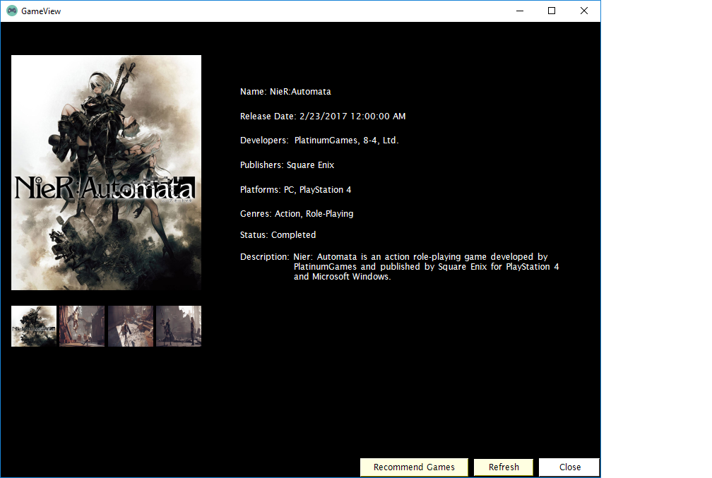
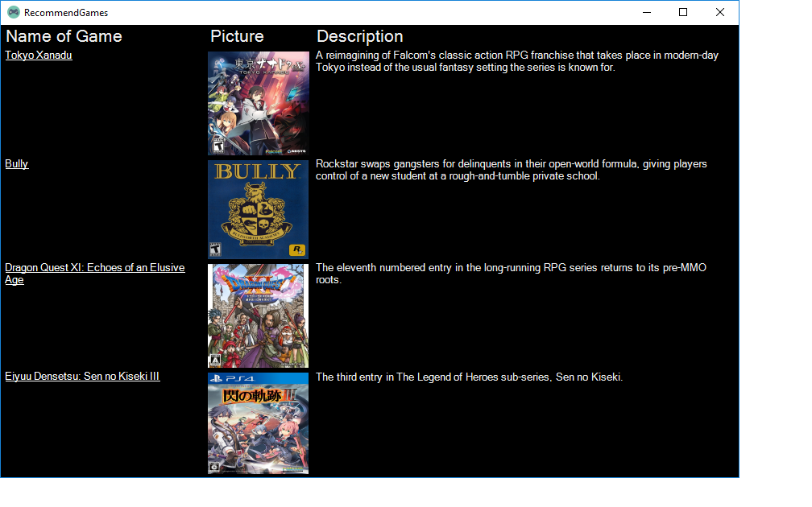
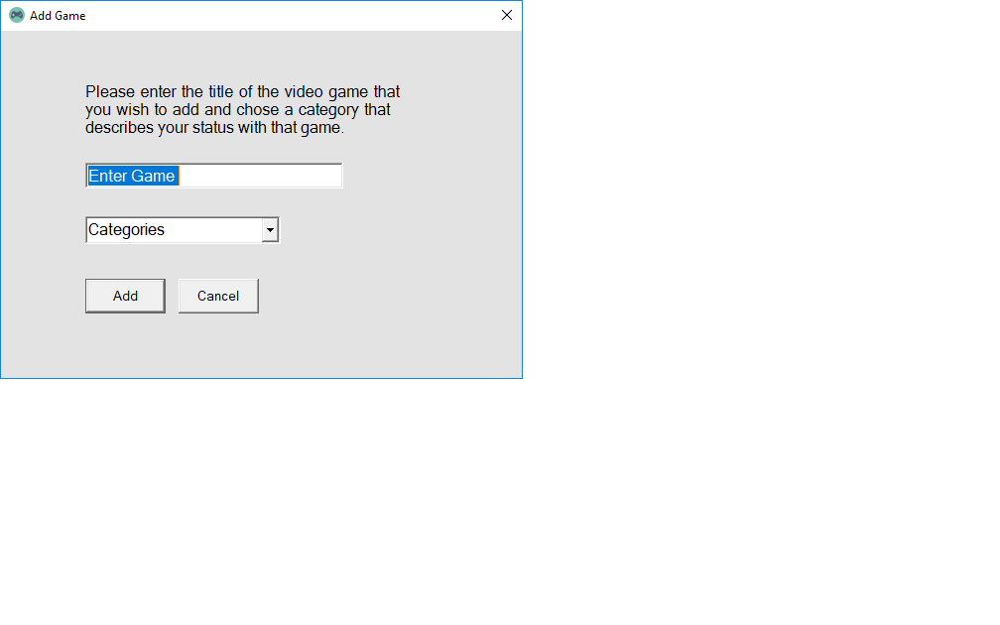
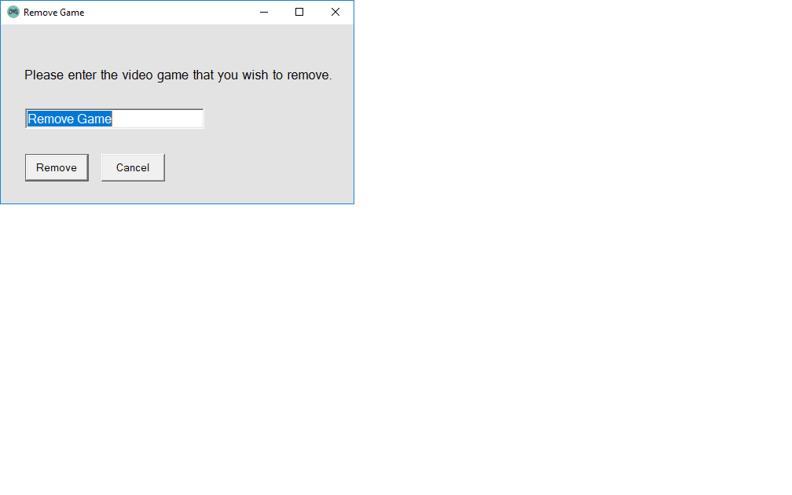

# CapstoneProject
Gamelogger is an application that allows users to add their gaming collection to this application. Gamelogger will allow users to add/remove games form its listview. The user can also click on a cell in the listview that contains a game and it will pop up a window that has information on that game. This window will also have a button that allows the users to look at similar games. 

   

## Setup Instructions
1. Click GameLogger.zip
2. Download GameLogger.zip 
3. Extarct Folder to Desktop 
4. Naviatge to the inside of the GameLogger folder 
5. Double click Setup.exe 
6. Follow on screen instructions 
 
 OR 
 
1. Click Clone or Download 
2. Click Open in Visual Studio 
3. Click Build 
4. Click Publish GameLogger
5. Click Next three times 
6. Click Finish 
7. File explorer appeaers, double click setup.exe
8. Follow on screen instructions 
8. Right click and drag to the desktop and click Create shortcuts here 

## Run Test 

1. Click Clone or Download 
2. Click Open in Visual Studio 
3. Move OGFile.xml, TestFile.xml, TestFile1.xml, and TestFile2.xml to ProgramData\GameLogger
4. In Visual Studio Click Test in the ToolBar
5. Now move your mouse over "Run" and click "All Test"  

## Refresh Application 
1. Click File 
2. Click Refresh Gamelist 

## Add Games 
1. Click File 
2. Click Add Game 
3. Follow the instructions on the screen 

## Remove Games 
1. Click File 
2. Click Remove Game 
3. Follow the instructions on the screen

Link to [Project Proposal](https://github.com/parkerjd4/CapstoneProject/blob/master/ProjectProposal.md)\
Link to [Final Technical Report](https://github.com/parkerjd4/CapstoneProject/blob/master/Final%20Technical%20Report)
